# LLM-MCP Framework

## 🚀 Overview

The **LLM-MCP Framework** is a completely generic Python framework for building any LLM-powered application with Model Context Protocol (MCP) tool integration. The framework is domain-agnostic and becomes whatever you need based on the prompts and tools you provide.

## ✨ Key Features

- **🔧 Generic & Extensible**: Adapts to any domain - code analysis, documentation, creative writing, security research, etc.
- **🔍 Semantic Search**: Advanced code understanding with vector embeddings and similarity search
- **⚡ MCP Integration**: Full Model Context Protocol support for tool execution
- **🌊 Streaming Support**: Real-time response streaming for interactive experiences
- **📊 Structured Responses**: Pydantic model-based response parsing and validation
- **🔄 Ephemeral Databases**: Fast in-memory semantic databases for temporary analysis
- **🛠️ Rich Tool Ecosystem**: File operations, semantic search, directory listing, and more

## ⚠️ Current Limitations

- **Context Window Management**: The framework currently lacks automatic context compression/summarization logic when tool outputs exceed the LLM's context window. Large tool responses may cause context overflow issues that need manual handling.
- **File Writing Security**: The `FileWriteTool` is currently disabled due to security concerns. LLM-controlled file writing poses risks including code injection, data corruption, and system compromise. See [`file_ops.py`](llm_mcp/tools/filesystem/file_ops.py) for required security measures before enabling.

## 🔒 Security Features

- **Path Traversal Protection**: All file operation tools include comprehensive path validation to prevent directory traversal attacks (e.g., `../../../etc/passwd`)
- **Sandboxed File Access**: File operations are restricted to the current working directory and its subdirectories
- **Input Validation**: Pydantic validators check all file paths for dangerous components and resolve paths safely
- **Disabled Write Operations**: File writing capabilities are completely disabled to prevent malicious file creation

## 🏗️ Architecture


## 🧩 Core Components

### 1. **Main Analyzer** ([`analyzer.py`](llm_mcp/analyzer.py))
The primary interface function that orchestrates the entire analysis pipeline:

```python
from llm_mcp import analyze_repository_with_llm
from pydantic import BaseModel

class SecurityAnalysis(BaseModel):
    vulnerabilities: List[str]
    risk_level: str
    recommendations: List[str]

result = await analyze_repository_with_llm(
    system_prompt="You are a security expert...",
    user_message="Analyze this codebase for vulnerabilities",
    response_model=SecurityAnalysis,
    repository_path="."
)
```

### 2. **LLM Session** ([`llm/session.py`](llm_mcp/llm/session.py))
Generic session management for any LLM provider with tool integration:

```python
from llm_mcp import LLMSession, GenericRequest

session = LLMSession(
    provider="openai",
    model="gpt-4",
    api_key="your-key"
)

async with session:
    response = await session.run_analysis(request)
```

### 3. **MCP Manager** ([`mcp/manager.py`](llm_mcp/mcp/manager.py))
High-level orchestration of MCP servers and tool execution:

```python
from llm_mcp.mcp.manager import MCPManager

manager = MCPManager(semantic_config=config)
await manager.initialize()
result = await manager.execute_tool_call(tool_call)
```

### 4. **Semantic Search** ([`tools/semantic/search.py`](llm_mcp/tools/semantic/search.py))
Advanced code understanding with vector embeddings:

```python
from llm_mcp.tools import SemanticSearchTool

search_tool = SemanticSearchTool(config)
results = await search_tool.execute(search_request, context)
```

### 5. **Ephemeral Databases** ([`rag/ephemeral.py`](llm_mcp/rag/ephemeral.py))
Fast, temporary semantic databases for analysis:

```python
from llm_mcp.rag import create_ephemeral_semantic_db

async with create_ephemeral_semantic_db(".") as db:
    config = db.get_semantic_config()
    # Use config with MCP server
```

## 🔧 Tool Ecosystem

The framework provides a rich set of tools that can be used by LLMs:

| Tool | Purpose | Security Features | Example Use Case |
|------|---------|-------------------|------------------|
| [`FileReadTool`](llm_mcp/tools/filesystem/file_ops.py) | Read file contents | 🔒 Path traversal protection | Code review, documentation |
| [`SemanticSearchTool`](llm_mcp/tools/semantic/search.py) | Vector-based code search | 🔒 Sandboxed search scope | Finding similar functions, patterns |
| [`SearchInFilesTool`](llm_mcp/tools/filesystem/search.py) | Regex/text search | 🔒 Directory restrictions | Finding specific patterns |
| [`ListDirectoryTool`](llm_mcp/tools/filesystem/file_ops.py) | Directory exploration | 🔒 Path validation | Project structure analysis |
| ~~[`FileWriteTool`](llm_mcp/tools/filesystem/file_ops.py)~~ | ~~File writing~~ | ⚠️ **DISABLED** for security | ~~File creation/modification~~ |

## 📊 Data Flow

```mermaid
sequenceDiagram
    box 👤 User Layer
        participant U as User
    end
    
    box 🎯 Framework Interface
        participant A as 🔬 Analyzer
        participant S as 🧠 LLMSession
    end
    
    box 📡 MCP Infrastructure
        participant M as 📡 MCPManager
        participant Server as 🖥️ FastMCPServer
    end
    
    box 🛠️ Tool Ecosystem
        participant T as 🔧 Tools
        participant ST as 🔍 SemanticTool
    end
    
    box 🔍 Vector Database
        participant Q as 🗄️ Qdrant
        participant E as 🧠 CPU Embedder
    end
    
    box ☁️ External Services
        participant L as 🤖 LLM Provider
    end

    U->>A: analyze_repository_with_llm()
    A->>A: Create EphemeralSemanticDB manager
    A->>Q: Initialize Qdrant collection
    A->>E: Load sentence-transformers model (CPU)
    Q-->>A: Database ready
    A-->>A: Generate semantic config
    A->>S: Initialize session
    S->>M: Setup MCP manager
    M->>Server: Start MCP server
    Server->>T: Register tools
    T->>ST: Register semantic search
    ST-->>Server: Tool registered
    Server-->>M: Tools ready
    A->>S: Send request with tools
    S->>L: LLM call with tool schemas
    L->>M: Execute tool calls
    M->>Server: Route tool execution
    Server->>ST: Execute semantic search
    ST->>E: Generate query embedding (CPU)
    E-->>ST: Query vector
    ST->>Q: Vector similarity search
    Q-->>ST: Similar code chunks
    ST-->>Server: Search results
    Server-->>M: Tool results
    M-->>L: Formatted results
    L-->>S: Response with tool outputs
    S->>S: Parse structured response
    S-->>A: Parsed response
    A-->>U: Structured result
    
    Note over L,M: ⚠️ Large tool outputs may<br/>exceed context window
    Note over E: Uses sentence-transformers<br/>models (CPU-bound)
    Note over ST,Q: 🔍 SemanticTool directly queries<br/>Qdrant vector database
```



## 🚀 Quick Start

### Installation

```bash
# Basic installation
pip install -e .

# With semantic search capabilities
pip install -e .[semantic]

# Set up API key (required)
export OPENROUTER_API_KEY="your-openrouter-key"
# OR
export OPENAI_API_KEY="your-openai-key"
```

### Basic Usage

```python
import asyncio
import os
from pydantic import BaseModel
from llm_mcp import analyze_repository_with_llm

class CodeReview(BaseModel):
    issues: List[str]
    suggestions: List[str]
    overall_quality: str

async def main():
    # Ensure API key is set
    if not os.getenv("OPENROUTER_API_KEY") and not os.getenv("OPENAI_API_KEY"):
        print("❌ Please set OPENROUTER_API_KEY or OPENAI_API_KEY environment variable")
        return
    
    result = await analyze_repository_with_llm(
        system_prompt="""You are an expert code reviewer.
        Analyze the codebase for issues and improvements.""",
        user_message="Review the Python files in this repository",
        response_model=CodeReview,
        repository_path="."
    )
    
    print(f"Found {len(result.issues)} issues")
    print(f"Quality: {result.overall_quality}")

asyncio.run(main())
```

## 🎯 Use Cases

The framework is completely generic and can be adapted for any domain:

### 🔒 Security Analysis
```python
class SecurityReport(BaseModel):
    vulnerabilities: List[Vulnerability]
    risk_score: int
    compliance_status: str

await analyze_repository_with_llm(
    system_prompt="You are a security researcher...",
    user_message="Find security vulnerabilities",
    response_model=SecurityReport
)
```

### 📚 Documentation Generation
```python
class Documentation(BaseModel):
    overview: str
    api_docs: List[APIDoc]
    examples: List[str]

await analyze_repository_with_llm(
    system_prompt="You are a technical writer...",
    user_message="Generate comprehensive documentation",
    response_model=Documentation
)
```

### 🏗️ Architecture Analysis
```python
class ArchitectureAnalysis(BaseModel):
    components: List[Component]
    dependencies: List[Dependency]
    recommendations: List[str]

await analyze_repository_with_llm(
    system_prompt="You are a software architect...",
    user_message="Analyze the system architecture",
    response_model=ArchitectureAnalysis
)
```

## 🔍 Semantic Search Features

The framework includes advanced semantic search capabilities with Qdrant vector database:

### Semantic Search Pipeline

```mermaid
graph LR
    A[Code Files] --> B[Language Parser]
    B --> C[Text Chunking]
    C --> D[CPU Embedder<br/>sentence-transformers]
    D --> E[Qdrant Vector DB]
    E --> F[Similarity Search]
    F --> G[Ranked Results]
    
    H[Search Query] --> I[Query Embedding<br/>CPU-bound]
    I --> F
    
    Note1[⚠️ Large result sets may<br/>exceed context limits]
    G --> Note1
    Note2[Models: codebert_st, minilm,<br/>unixcoder, codebert]
    D --> Note2
```


### Complete Integration Flow with Component Layers

```mermaid
sequenceDiagram
    box LLM Layer
        participant LLM as 🧠 LLM
    end
    
    box MCP Framework
        participant MCP as 📡 MCPManager
        participant Server as 🖥️ FastMCPServer
    end
    
    box Tool Layer
        participant ST as 🔍 SemanticSearchTool
        participant FT as 📁 FileReadTool
    end
    
    box Vector Database Infrastructure
        participant Q as 🗄️ Qdrant
        participant E as 🧠 CPU Embedder
        participant FS as 💾 FileSystem
    end

    LLM->>MCP: working_semantic_search(query, patterns)
    MCP->>Server: Route tool call
    Server->>ST: Execute semantic search
    
    alt Database exists
        ST->>Q: Check collection exists
        Q-->>ST: ✅ Collection found
    else Database needs creation
        ST->>FS: Scan repository files
        FS-->>ST: 📄 File list with patterns
        ST->>E: Generate embeddings for chunks (CPU)
        E-->>ST: 🔢 Vector embeddings
        ST->>Q: Create collection & store vectors
        Q-->>ST: ✅ Database ready
    end
    
    ST->>E: Embed search query (CPU)
    E-->>ST: 🎯 Query vector
    ST->>Q: Vector similarity search
    Q-->>ST: 📊 Similar code chunks
    ST->>ST: Rank & filter results
    ST-->>Server: Structured search results
    Server-->>MCP: Tool response
    MCP-->>LLM: 📋 Code chunks with context
    
    Note over Q: Qdrant is the actual vector database<br/>storing and searching embeddings
    Note over E: Uses sentence-transformers models<br/>(codebert_st, minilm, etc.) on CPU
    Note over ST: SemanticSearchTool directly<br/>manages Qdrant operations
    Note over MCP,Server: MCP Protocol handles<br/>tool orchestration
```


### Ephemeral Database Lifecycle


### Features:
- **🧠 Code Understanding**: Uses specialized embeddings for code
- **⚡ Fast Search**: Vector similarity search with Qdrant
- **🎯 Contextual Results**: Returns code with surrounding context
- **🔄 Incremental Indexing**: Efficient updates for large codebases
- **🌐 Multi-Language**: Supports Python, JavaScript, TypeScript, Go, and more
- **💾 Ephemeral Storage**: Temporary databases in `/dev/shm` for fast access
- **♻️ Database Reuse**: Option to reuse semantic databases across multiple analyses

## 📁 Project Structure

```
llm_mcp/
├── __init__.py              # Main exports and framework interface
├── analyzer.py              # Primary analysis function
├── llm/                     # LLM client and session management
│   ├── client.py           # Generic LLM client
│   └── session.py          # Session orchestration
├── mcp/                     # Model Context Protocol integration
│   ├── client.py           # MCP client implementation
│   ├── manager.py          # High-level MCP orchestration
│   └── server/             # MCP server components
├── tools/                   # Tool ecosystem
│   ├── filesystem/         # File system operations
│   └── semantic/           # Semantic search tools
├── models/                  # Pydantic models and schemas
├── rag/                     # Retrieval Augmented Generation
└── utils/                   # Utilities and constants

examples/                    # Usage examples and demos
```

## 🛠️ Configuration

### Environment Variables
```bash
# Required: API key for LLM access
export OPENROUTER_API_KEY="your-openrouter-key"  # Preferred for multi-model access
# OR
export OPENAI_API_KEY="your-openai-key"          # Alternative

# Optional: For embeddings cache
export HF_HOME="~/.cache/huggingface"
```

**Note**: The framework requires either `OPENROUTER_API_KEY` or `OPENAI_API_KEY` to be set. If neither is found, the analyzer will raise a `ValueError` with setup instructions.

### Semantic Search Configuration
```python
from llm_mcp.models.semantic import SemanticSearchConfig, EmbeddingModel

config = SemanticSearchConfig(
    embedding_model=EmbeddingModel.minilm(),  # Lightweight
    # embedding_model=EmbeddingModel.codebert(),  # Better for code
    chunk_size=1000,
    chunk_overlap=200,
    similarity_threshold=0.7
)
```

### Managing Context Window Limits

When working with large codebases, be mindful of context window limitations:

```python
# Limit search results to prevent context overflow
search_request = SemanticSearchRequest(
    query="authentication logic",
    max_results=5,  # Limit results
    similarity_threshold=0.8,  # Higher threshold for more relevant results
    include_context=False  # Reduce context to save tokens
)

# For large files, consider chunking or summarization
# (Manual implementation required currently)
```

## 📋 Examples

The framework includes comprehensive examples in the [`examples/`](examples/) directory:

- **[`basic_usage.py`](examples/basic_usage.py)**: Demonstrates framework versatility across domains
- **[`semantic_search_example.py`](examples/semantic_search_example.py)**: Advanced semantic search capabilities
- **[`mcp_integration_example.py`](examples/mcp_integration_example.py)**: MCP server integration
- **[`semantic_ingestion_example.py`](examples/semantic_ingestion_example.py)**: Database creation and ingestion

## 🔧 Tool Integration

### MCP Tool Registry Architecture

```mermaid
graph TD
    subgraph "🎯 Session Layer"
        H[LLMSession]
    end
    
    subgraph "📡 MCP Management Layer"
        subgraph "Manager"
            G[MCPManager]
        end
        subgraph "Server Process"
            F[FastMCPServer]
        end
    end
    
    subgraph "🛠️ Tool Registration Layer"
        subgraph "Registry Core"
            A[MCPToolRegistry]
            A1[Tool Registration Map]
            A --> A1
        end
        subgraph "Security Layer"
            Note1[⚠️ Tool outputs may need<br/>compression for large responses]
            Note2[🔒 FileWriteTool disabled<br/>for security reasons]
        end
    end
    
    subgraph "🔧 Framework Tools"
        subgraph "File Operations"
            B[FileReadTool]
            D[SearchInFilesTool]
            E[ListDirectoryTool]
        end
        subgraph "Semantic Operations"
            C[SemanticSearchTool]
        end
        subgraph "Disabled Tools"
            X[~~FileWriteTool~~]
        end
    end
    
    H --> G
    G --> F
    F --> A
    A --> B
    A --> C
    A --> D
    A --> E
    A -.-> X
    
    A --> Note1
    X --> Note2
    
    style X fill:#ffebee,stroke:#f44336,stroke-dasharray: 5 5
    style Note2 fill:#ffebee,stroke:#f44336
```



### Tool Execution Flow


## 🚀 Advanced Features

### Streaming Responses
```python
async for event in session.stream_analysis(request):
    if event.event_type == "content_chunk":
        print(event.delta, end="", flush=True)
    elif event.event_type == "complete":
        print("\n✅ Complete!")
```

### Batch Processing
```python
batch_request = BatchRequest(requests=[req1, req2, req3])
results = await session.run_batch_analysis(batch_request)
```

### Custom Tools
```python
from llm_mcp.tools.base import BaseTool

class CustomTool(BaseTool):
    async def execute(self, input_data, context):
        # Your custom logic here
        # Consider output size for context window
        return result
```

## 🔮 Future Enhancements

- **Context Compression**: Automatic summarization of large tool outputs
- **Intelligent Chunking**: Smart content splitting for context management
- **Result Prioritization**: Ranking and filtering of tool results
- **Memory Management**: Persistent context across multiple interactions

## 🤝 Contributing

1. Fork the repository
2. Create a feature branch
3. Add tests for new functionality
4. Submit a pull request

## 📄 License

This project is licensed under the MIT License - see the LICENSE file for details.

## 🙏 Acknowledgments

- **FastMCP**: Model Context Protocol implementation
- **LangChain**: Document processing and embeddings
- **Qdrant**: Vector database for semantic search
- **HuggingFace**: Transformer models and embeddings

---

**The LLM-MCP Framework: Making AI-powered applications as easy as writing a prompt.** 🚀